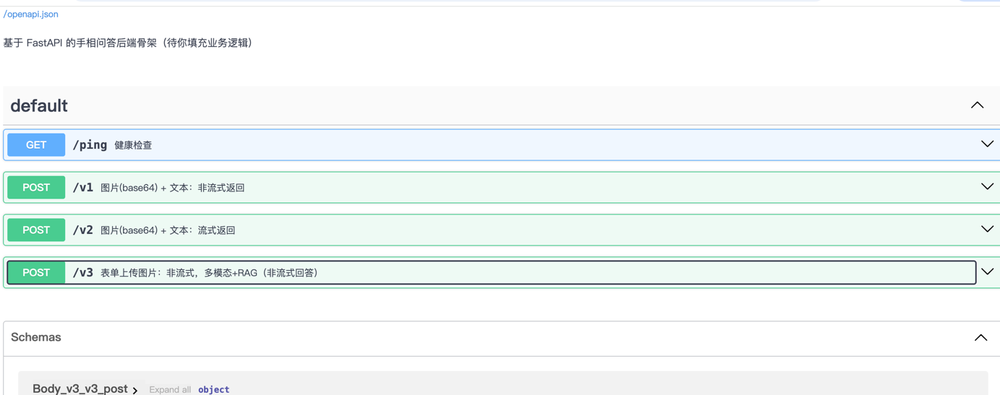

# 零.项目概述

本项目旨在将传统的手相学与现代人工智能技术相结合，打造一个 基于大模型的智能算命大师系统。
通过融合 多模态大模型（MLLM）、知识增强检索（RAG）、图像预处理 与 Embedding 技术，系统能够对用户上传的手掌图片进行掌纹特征提取和分析，并结合手相学知识库与大语言模型的生成能力，为用户提供个性化的“手相解析”与互动问答体验。

## 零.1.项目整体流程：

	1.	图像输入：用户通过前端上传手掌图片（支持 base64 或表单上传）。
	2.	图像预处理：对图片进行手掌区域提取、灰度化、边缘检测等操作，得到清晰掌纹图。
	3.	多模态大模型（MLLM）：将图片上传至大模型，自动生成掌纹各条线（生命线、智慧线、感情线、婚姻线、事业线）的文字描述。
	4.	知识增强检索（RAG）：结合事先整理好的手相学知识库，对掌纹结果进行语义检索，匹配更权威的解释内容。
	5.	大语言模型（LLM）对话：利用大模型将用户问题、掌纹特征和检索结果综合，生成最终回答。
	6.	接口与前端交互：通过 FastAPI/Flask 提供接口，支持流式和非流式问答，前端页面直观展示。


## 零.2.当前困境

尽管系统架构已基本成型，但目前仍存在以下困境与挑战：

	1.	多模态模型调用成本与稳定性
	•	目前依赖的 DashScope（Qwen-VL）与 GPT-4o 接口成本较高，且调用速度与稳定性在高并发下可能不足。
	•	本地化大模型（如 Qwen2.5-VL）部署存在显存要求高、启动报错等问题，阻碍了模型的私有化落地。
	2.	图像预处理效果不稳定
	•	在不同光照、肤色、背景下，手掌区域提取和掌纹增强效果不一致，可能影响后续多模态识别的准确性。
	3.	知识库覆盖度有限
	•	目前的知识库主要依赖爬虫数据和 Qwen 润色扩展，存在内容单一、解释片面的问题，难以支撑更复杂或长尾的手相问题。
	4.	前后端交互不够完善
	•	前端缺乏便捷的图片上传与历史问答记录功能；
	•	后端接口虽已提供 v1/v2/v3 三种模式，但 RAG 与 MLLM 部分的结果融合逻辑仍需进一步优化。


## 零.3.本项目解决的内容

针对以上困境，本项目的核心解决方案包括：

	1.	多模态与大模型结合
	•	使用 Qwen-VL 多模态模型 自动解析图片，输出掌纹线条的结构化描述。
	•	再通过 Qwen-Plus / GPT-3.5 等大语言模型进行自然语言生成，提升用户体验。
	2.	图像预处理优化
	•	在 HSV 颜色空间中分离手掌皮肤区域，并应用 形态学操作 + Laplacian 边缘检测，有效增强掌纹可见度，提升模型输入质量。
	3.	知识增强检索（RAG）机制
	•	使用 BAAI/bge 系列 Embedding 模型，将手相知识转化为向量表示，并在查询时通过余弦相似度检索最相关的内容，保证回答的专业性与多样性。
	4.	灵活的接口设计
	•	v1：base64 图片上传，非流式回答；
	•	v2：base64 图片上传，流式回答；
	•	v3：表单上传图片 + 文本输入，支持多模态问答与 RAG 检索。
	•	支持 Swagger 自动文档（/docs），便于前端联调和测试。
	5.	可扩展性
	•	项目架构支持接入更多大模型（如本地 Qwen2.5-VL、LLaVA），以及扩展到其它相术或娱乐应用场景。


# 一.数据集介绍：

spider部署主要是对原始的数据集进行获取，简单的爬虫程序获取到数据集。
数据集主要是手相学相关的内容，包含了手相特征的分类、具体特征以及对应的描述。数据集结构如下：

	•	topic：大类，主要是“感情线（天纹）” 这类手相特征的大分类。
	•	feature：细分特征，比如“感情线有二”“感情线分岔”“感情线与智慧线相交”等，具体描述手掌线上出现的某种形态。
	•	describe：对应特征的详细描述，解释其在手相学中的含义。例如，
	•	“感情线有二，二条感情线，婚姻易有第三者出现，两人相处之间，若不是分居，经常分离或是离婚，就是自己命短。”
	•	“感情线分岔，经验戏剧性的相逢与命中注定的分离。”
	•	“感情线止于无名指，个性任性，不听他人劝告。”

llm.py：该文件对爬去出来的原数据进行再次处理，使用了GPT-3.5-turbo模型对数据进行润色和扩展。使得数据更加丰富并且具体。

# 二.MLLM部分介绍：

该部分使用多模态模型，来处理输入进来的图片链接（可以扩展为本地图片）；统一设置好提示词后，模型的输出将会按照提示词的要求进行输出。

# 三.pic2url & preprocess & embedding 部分介绍：
**1.该部分主要是对输入的图片进行处理，pic2url部分是将本地图片上传到图床，并获取图片链接；该部分主要是用的方法为OSS（对象存储服务，这个是阿里的要收费），也可以使用其他的图床服务。**

**2.preprocess部分是对图片进行预处理，调整大小、格式等，以适应后续模型的输入要求。**

	1.	读入一张手掌图片；
	2.	提取手掌区域；（转换到 HSV 空间并提取皮肤区域；去噪与膨胀操作；提取手掌并转为灰度图）
	3.	提高对比度；
	4.	提取边缘（掌纹）；方法：使用 Laplacian 算子提取图像边缘，使掌纹变得清晰。
	5.	保存结果。

**3.embedding部分是将处理后的图片进行特征提取，转换为向量表示，以便后续的相似度计算和检索。**

# 四.LLM部分介绍：
这里主要分为两部分一个是对话模型（分为stream和no stream的方式），一个是检索模型。


# 五.RAG部分介绍：
其中Knowledge主要实现了RAG的主要功能；这里是一个简单的实现，主要运用的余选相似度的计算；

	1.	把一批文本转为向量（embedding），并持久化保存；
	2.	加载保存好的知识向量和文本；
	3.	接收查询，计算查询与知识向量的相似度；

# 六.接口启动代码介绍：
其中一共提供了三个接口：
**1.v1接口主要是对话接口，输入图片链接和问题，输出回答；（使用的是非流失的输出结果）。base64 图片上传 -> 非流式返回**
当一张图片输入的时候，
    1.会先将其保存到本地；
    2.然后进行预处理操作；
    3.上传云图操作；
    4.然后进行多模态分析；
        假如多模态分析的结果为：  
```python
            {
              "生命线": "生命线从拇指根部开始，环绕大鱼际区域，走向较为圆润，长度适中，显示生命力较强，身体健康状况良好，但需注意避免过度劳累。",
              "智慧线": "智慧线从拇指与食指之间向小指方向延伸，线条明显，略有分叉，显示出思维活跃、逻辑性强，具有较强的学习能力和分析能力，但有时可能过于追求完美。",
              "感情线": "感情线较为清晰，从拇指根部延伸至小指下方，线条平直且较深，表明情感表达较为稳定，内心情感丰富但不轻易外露，可能在感情中较为理性。",
              "婚姻线": "婚姻线位于小指下方，有两条较浅的横线，其中一条较明显，另一条较模糊，暗示感情经历可能较为复杂，或有过短暂的感情关系，但最终可能会有稳定的情感归宿。",
              "事业线": "事业线从手掌底部向上延伸，贯穿掌心，线条清晰且略呈波浪状，说明事业心强，有明确的目标和规划，工作上容易获得成就，但过程中可能经历起伏。"
            }
```
    5.拿到多模态分析的结果，然后再进行rag检索；
    6.如果不传入feature的话，那么就默认输出全部线的解析；最后拿着下面的promot来进行大模型回答；
```python
你是一个算命大师,你需要结合用户的手相特征和已知信息回答用户的问题

现在用户的手相特征如下:
---
生命线: 生命线起于拇指根部，环绕大鱼际，线条较深且连续，呈现圆润弧形，表明身体健康状况良好，生命力较强，具有较强的抗压能力。
智慧线: 智慧线从拇指与食指之间向小指方向延伸，走向清晰且略带弯曲，显示思维活跃，逻辑分析能力较强，注重理性思考，但可能偶尔过于谨慎。
感情线: 感情线较为清晰，从手掌边缘延伸至食指下方，走向平直，末端略微上扬，显示情感表达较为稳定，有较强的情感感知能力。
婚姻线: 在小指根部下方可见一条较浅的横纹，位置接近掌缘，线条不明显，说明对婚姻关系的态度较为随性，可能晚婚或对婚姻持开放态度，感情生活相对自由。
事业线: 事业线从手掌底部向上延伸，走向较为笔直，贯穿掌心并接近中指下方，线条清晰，显示出较强的事业心和目标感，适合从事需要坚持和专注的工作。
---

目前已知的信息是:
---
用户的生命线特征:
掌纹类型:生命线
        掌纹特征:起于拇指和食指间,包拥金星丘，与大血管、心脏、胃及消化系统密切相关
        掌纹描述:生命线是手相学中的重要线条之一，起于拇指和食指间，包拥金星丘，代表着一个人的生命力和健康状况。生命线与大血管、心脏、胃及消化系统密切相关，它不仅反映了一个人的身体健康状况，还可以揭示一个人的生活态度和生存能力。在手相学中，生命线的长度、深浅、清晰度等都可以提供重要的信息，帮助人们了解自己的健康状况和生命走向。

用户的智慧线特征:
掌纹类型:智慧线
        掌纹特征:智慧线起点与生命线同,向小指方向延伸，至无名指与小指指缝间停最好。
        掌纹描述:智慧线又称头脑线，起点与生命线相同，向小指方向延伸，直至无名指与小指指缝间停止。智慧线的走势代表着个人的智慧、学识和思维能力。线条清晰明了代表着理性思维，而断断续续则可能暗示着思维不够集中。智慧线的长度和深浅也会反映出个人的学识面广度和深度。在相学中，智慧线的状况可以帮助人们了解自己的学习能力和智力发展情况。

用户的感情线特征:
掌纹类型:感情线
        掌纹特征:末端伸至食指与中指之间，开叉，支线向上或向下
        掌纹描述:感情线末端伸至食指与中指之间，开叉，支线向上者，代表个性较为好胜，追求成功的欲望强烈；支线向下者，个性较为随和、善于沟通，喜欢与人交流。感情线的走势可以反映一个人在感情方面的态度和倾向，带有感情线的人通常较为重视感情生活，注重家庭和人际关系。

用户的婚姻线特征:
掌纹类型:婚姻线
        掌纹特征:婚姻线尾端向著小指根方向彎上去
        掌纹描述:婚姻线尾端向小指根方向弯曲，暗示可能因某种原因而抱持独生主义观念，终身不考虑婚姻。这种特征可能代表个体对婚姻关系持有独立自主的态度，更注重个人发展和自由。在感情方面，可能更倾向于独立生活，不愿受到婚姻关系的束缚。需要注意的是，婚姻线只是手相学中的一种线条，不代表一切，个体仍需综合考虑其他线条和因素来进行分析。

用户的事业线特征:
掌纹类型:事业线
        掌纹特征:直抵中指根部
        掌纹描述:事业线直抵中指根部，表示事业顺利，目标明确。这条线代表着你在事业上的成就和发展，预示着你在工作中会有很好的表现和成就。拥有这样的事业线，说明你在事业上会有很好的发展前景，能够取得成功。但也需要注意保持目标的明确性，不要被外界因素所干扰，保持专注和努力，才能更好地实现事业目标。
---

用户的问题是:
---
分析一下自己的手势
---
```
**2.v2接口**

v2接口做的依然是相同的事情，只不过在这里做的是流式的输出，其他的步骤和v1是一样的；base64 图片上传 -> 流式返回。

**3.v3接口**

在这的前端输入是通过format的格式来进行输入的，其中的核心思想是和v1、v2是一样的。

# 七.如何运行该程序：
**1.安装依赖：**

```bash

pip install -r requirements.txt
```

**2.阅读README_OSS.md文件来配置OSS服务；**

**3.需要在config文件中配置上你所调用模型的key值**

- key：对应的是embeeding.py；这里调用的是https://siliconflow.cn/
- API_KEY：
- BASE_URL：对应的是阿里云百炼 DashScope 平台的 API Key
- accessKeyId_： 对应的是阿里云的accessKeyId
- accessKeySecret_： 对应的是阿里云的accessKeySecret；可以用来访问 OSS（对象存储）、RAM、ECS、以及包括 百炼 DashScope 在内的云服务。


# 八.性能指标：
单条相应的时间大约为2-3秒。


