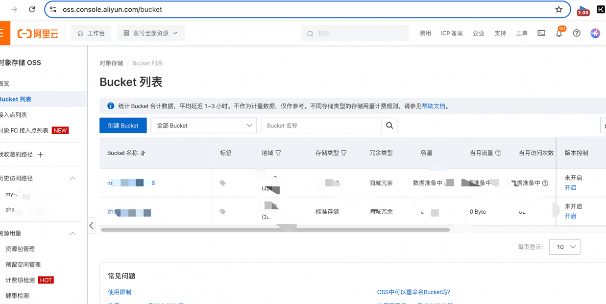
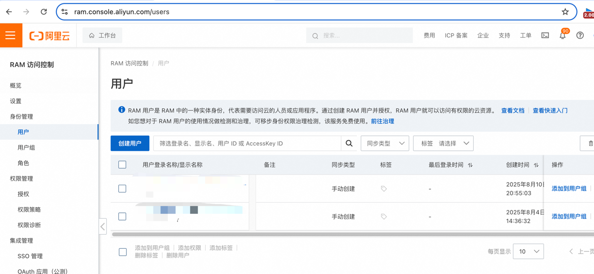

# 阿里云 OSS 创建与配置教程

## 1. 创建 OSS Bucket（存储空间）
[**👉 前往 OSS 控制台**](https://oss.console.aliyun.com/bucket)

1. **登录** 阿里云 OSS 控制台  
2. 点击 **创建 Bucket**，填写以下信息：  
   - **Bucket 名称**：自定义一个全局唯一的名称，例如 `my-image-bed`
   - **地域（Region）**：建议选择离业务最近的区域
   - **读写权限**：
     - 如果仅自己使用，选择 **私有**（后续可在 Bucket 设置中修改为 **公共读**）
   - 其他选项保持默认  
3. 点击 **确认创建**  

> **修改读写权限路径**：  
> OSS 控制台 → 选择你的 Bucket → **权限管理** → **读写权限（ACL）** → **公共读**

---

## 2. 创建 RAM 用户（API 访问凭证）
[**👉 前往 RAM 控制台**](https://ram.console.aliyun.com/users)

1. 打开 RAM 控制台 → **用户管理** → **创建用户**  
2. 选择：  
   - **访问方式**：勾选 **编程访问（AccessKey）**
   - 用户名：例如 `oss-upload-user`
3. 创建完成后，你将获得：  
   - **AccessKey ID**
   - **AccessKey Secret**
4. 分配权限：  
   - 点击该用户 → **添加权限**
   - 搜索 **AliyunOSSFullAccess**
   - 点击 **授权**

---

## 3. 完成
至此你已经完成以下配置：
- ✅ 创建了一个 OSS 存储空间（Bucket）
- ✅ 获取了 API 访问凭证（AccessKey ID / Secret）
- ✅ 分配了 **AliyunOSSFullAccess** 权限

---